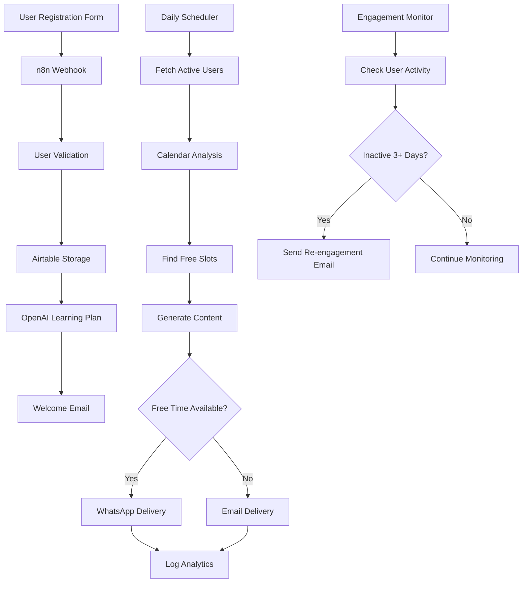

# Complete Micro-Learning System Implementation

## Table of Contents

1. [System Architecture](#system-architecture)
2. [Database Setup (Airtable)](#database-setup-airtable)
3. [Google Sheets Analytics Setup](#google-sheets-analytics-setup)
4. [User Registration Form](#user-registration-form)
5. [n8n Workflow Implementations](#n8n-workflow-implementations)
6. [Environment Configuration](#environment-configuration)
7. [Testing & Deployment](#testing--deployment)

## System Architecture



## Database Setup (Airtable)

### Airtable Base Configuration

```javascript
// Airtable Base Structure
const AIRTABLE_CONFIG = {
  baseId: "appXXXXXXXXXXXXXX", // Replace with your base ID
  apiKey: "keyXXXXXXXXXXXXXX", // Replace with your API key
  tables: {
    users: "Users",
    lessons: "Lessons",
    engagement: "Engagement"
  }
};

// Users Table Schema
const USERS_TABLE_SCHEMA = {
  fields: {
    user_id: "Single line text (Primary Field)",
    name: "Single line text",
    email: "Email",
    whatsapp: "Phone number",
    job_title: "Single line text",
    skill_gaps: "Multiple select",
    learning_format: "Single select (Video, Text, Mixed, Interactive)",
    preferred_time: "Single select (Morning, Afternoon, Evening)",
    timezone: "Single select",
    registration_date: "Date",
    last_learning_session: "Date & time",
    total_sessions: "Number",
    completion_rate: "Percent",
    status: "Single select (active, paused, inactive, completed)",
    calendar_email: "Email",
    notification_preferences: "Multiple select (Email, WhatsApp, SMS)"
  }
};

// Lessons Table Schema
const LESSONS_TABLE_SCHEMA = {
  fields: {
    lesson_id: "Single line text (Primary Field)",
    user_id: "Single line text",
    day: "Number",
    title: "Single line text",
    content_type: "Single select (Video, Article, Exercise, Quiz)",
    description: "Long text",
    keywords: "Multiple select",
    difficulty_level: "Single select (Beginner, Intermediate, Advanced)",
    estimated_duration: "Number (minutes)",
    status: "Single select (pending, delivered, completed, skipped)",
    created_date: "Date & time",
    delivery_date: "Date & time",
    completion_date: "Date & time",
    delivery_method: "Single select (Email, WhatsApp, SMS)",
    engagement_score: "Number",
    user_feedback: "Single select (👍, 👎, ❤️, 🤔)"
  }
};
```

### Airtable Setup Script

```javascript
// airtable-setup.js
const Airtable = require('airtable');

const base = new Airtable({
  apiKey: process.env.AIRTABLE_API_KEY
}).base(process.env.AIRTABLE_BASE_ID);

// Sample data insertion for testing
async function setupSampleData() {
  try {
    // Create sample user
    const sampleUser = await base('Users').create({
      user_id: 'test_user_001',
      name: 'John Doe',
      email: 'john.doe@example.com',
      whatsapp: '+1234567890',
      job_title: 'Software Developer',
      skill_gaps: ['Python', 'Leadership', 'Data Analysis'],
      learning_format: 'Mixed',
      preferred_time: 'Morning',
      timezone: 'UTC-5',
      registration_date: new Date().toISOString().split('T')[0],
      total_sessions: 0,
      completion_rate: 0,
      status: 'active',
      calendar_email: 'john.doe@example.com',
      notification_preferences: ['Email', 'WhatsApp']
    });

    console.log('Sample user created:', sampleUser.id);
    return sampleUser;
  } catch (error) {
    console.error('Error setting up sample data:', error);
  }
}

module.exports = { setupSampleData, base };
```

## Google Sheets Analytics Setup

### Analytics Sheet Structure

```javascript
// google-sheets-config.js
const GOOGLE_SHEETS_CONFIG = {
  spreadsheetId: "1XXXXXXXXXXXXXXXXXXXXXXXXXXXXXXXXXX", // Replace with your sheet ID
  sheets: {
    engagement: "Engagement",
    analytics: "Analytics", 
    performance: "Performance"
  }
};

// Engagement Sheet Headers (Row 1)
const ENGAGEMENT_HEADERS = [
  "Timestamp",
  "User ID", 
  "User Name",
  "Email",
  "Lesson Title",
  "Content Type",
  "Delivery Method",
  "Free Slots Count",
  "Lesson Day",
  "Status",
  "Response Time (minutes)",
  "Engagement Score",
  "Calendar Conflicts",
  "Preferred Time Slot",
  "Actual Delivery Time"
];

// Analytics Sheet Headers
const ANALYTICS_HEADERS = [
  "Date",
  "Total Active Users",
  "Lessons Delivered",
  "Completion Rate",
  "WhatsApp Deliveries",
  "Email Deliveries", 
  "Average Response Time",
  "Re-engagement Campaigns",
  "New Registrations",
  "Churn Rate"
];
```

### Google Sheets Setup Script

```javascript
// sheets-setup.js
const { GoogleSpreadsheet } = require('google-spreadsheet');

async function setupAnalyticsSheets() {
  const doc = new GoogleSpreadsheet(process.env.GOOGLE_SHEETS_ID);
  
  // Initialize auth
  await doc.useServiceAccountAuth({
    client_email: process.env.GOOGLE_SERVICE_ACCOUNT_EMAIL,
    private_key: process.env.GOOGLE_SERVICE_ACCOUNT_PRIVATE_KEY.replace(/\\n/g, '\n'),
  });

  await doc.loadInfo();
  
  // Setup Engagement Sheet
  let engagementSheet;
  try {
    engagementSheet = doc.sheetsByTitle['Engagement'];
  } catch {
    engagementSheet = await doc.addSheet({ 
      title: 'Engagement',
      headerValues: ENGAGEMENT_HEADERS
    });
  }

  // Setup Analytics Sheet  
  let analyticsSheet;
  try {
    analyticsSheet = doc.sheetsByTitle['Analytics'];
  } catch {
    analyticsSheet = await doc.addSheet({
      title: 'Analytics', 
      headerValues: ANALYTICS_HEADERS
    });
  }

  console.log('Google Sheets setup completed');
  return { engagementSheet, analyticsSheet };
}

module.exports = { setupAnalyticsSheets, ENGAGEMENT_HEADERS, ANALYTICS_HEADERS };
```

## User Registration Form

### HTML Registration Form

```html
<!DOCTYPE html>
<html lang="en">
<head>
    <meta charset="UTF-8">
    <meta name="viewport" content="width=device-width, initial-scale=1.0">
    <title>Personalized Micro-Learning Registration</title>
    <style>
        * {
            margin: 0;
            padding: 0;
            box-sizing: border-box;
        }
        
        body {
            font-family: 'Segoe UI', Tahoma, Geneva, Verdana, sans-serif;
            background: linear-gradient(135deg, #667eea 0%, #764ba2 100%);
            min-height: 100vh;
            display: flex;
            align-items: center;
            justify-content: center;
            padding: 20px;
        }
        
        .form-container {
            background: rgba(255, 255, 255, 0.95);
            padding: 40px;
            border-radius: 20px;
            box-shadow: 0 20px 40px rgba(0, 0, 0, 0.1);
            max-width: 600px;
            width: 100%;
            backdrop-filter: blur(10px);
        }
        
        .form-header {
            text-align: center;
            margin-bottom: 30px;
        }
        
        .form-header h1 {
            color: #333;
            font-size: 2.5em;
            margin-bottom: 10px;
        }
        
        .form-header p {
            color: #666;
            font-size: 1.1em;
        }
        
        .form-group {
            margin-bottom: 25px;
        }
        
        .form-group label {
            display: block;
            margin-bottom: 8px;
            color: #333;
            font-weight: 600;
            font-size: 1.1em;
        }
        
        .form-group input,
        .form-group select,
        .form-group textarea {
            width: 100%;
            padding: 15px;
            border: 2px solid #e1e1e1;
            border-radius: 10px;
            font-size: 1em;
            transition: all 0.3s ease;
            background: #f8f9fa;
        }
        
        .form-group input:focus,
        .form-group select:focus,
        .form-group textarea:focus {
            outline: none;
            border-color: #667eea;
            background: white;
            transform: translateY(-2px);
            box-shadow: 0 5px 15px rgba(102, 126, 234, 0.2);
        }
        
        .checkbox-group {
            display: grid;
            grid-template-columns: repeat(auto-fit, minmax(200px, 1fr));
            gap: 15px;
            margin-top: 10px;
        }
        
        .checkbox-item {
            display: flex;
            align-items: center;
            padding: 12px;
            background: #f8f9fa;
            border-radius: 8px;
            transition: all 0.3s ease;
        }
        
        .checkbox-item:hover {
            background: #e9ecef;
            transform: translateY(-1px);
        }
        
        .checkbox-item input[type="checkbox"] {
            width: auto;
            margin-right: 10px;
            transform: scale(1.2);
        }
        
        .submit-btn {
            width: 100%;
            padding: 18px;
            background: linear-gradient(135deg, #667eea 0%, #764ba2 100%);
            color: white;
            border: none;
            border-radius: 10px;
            font-size: 1.2em;
            font-weight: 600;
            cursor: pointer;
            transition: all 0.3s ease;
            margin-top: 20px;
        }
        
        .submit-btn:hover {
            transform: translateY(-3px);
            box-shadow: 0 10px 25px rgba(102, 126, 234, 0.3);
        }
        
        .submit-btn:active {
            transform: translateY(-1px);
        }
        
        .loading {
            display: none;
            text-align: center;
            margin-top: 20px;
        }
        
        .success-message {
            display: none;
            background: #d4edda;
            color: #155724;
            padding: 20px;
            border-radius: 10px;
            margin-top: 20px;
            text-align: center;
        }
        
        .error-message {
            display: none;
            background: #f8d7da;
            color: #721c24;
            padding: 20px;
            border-radius: 10px;
            margin-top: 20px;
            text-align: center;
        }
    </style>
</head>
<body>
    <div class="form-container">
        <div class="form-header">
            <h1>🎓 Start Your Learning Journey</h1>
            <p>Get personalized 5-minute learning sessions delivered at perfect moments</p>
        </div>
        
        <form id="registrationForm">
            <div class="form-group">
                <label for="name">Full Name *</label>
                <input type="text" id="name" name="name" required>
            </div>
            
            <div class="form-group">
                <label for="email">Email Address *</label>
                <input type="email" id="email" name="email" required>
            </div>
            
            <div class="form-group">
                <label for="whatsapp">WhatsApp Number (with country code)</label>
                <input type="tel" id="whatsapp" name="whatsapp" placeholder="+1234567890">
            </div>
            
            <div class="form-group">
                <label for="job_title">Job Title/Role *</label>
                <input type="text" id="job_title" name="job_title" required>
            </div>
            
            <div class="form-group">
                <label for="company">Company (Optional)</label>
                <input type="text" id="company" name="company">
            </div>
            
            <div class="form-group">
                <label>Skill Gaps & Learning Goals *</label>
                <div class="checkbox-group">
                    <div class="checkbox-item">
                        <input type="checkbox" id="python" name="skill_gaps" value="Python Programming">
                        <label for="python">Python Programming</label>
                    </div>
                    <div class="checkbox-item">
                        <input type="checkbox" id="leadership" name="skill_gaps" value="Leadership">
                        <label for="leadership">Leadership</label>
                    </div>
                    <div class="checkbox-item">
                        <input type="checkbox" id="data_analysis" name="skill_gaps" value="Data Analysis">
                        <label for="data_analysis">Data Analysis</label>
                    </div>
                    <div class="checkbox-item">
                        <input type="checkbox" id="project_management" name="skill_gaps" value="Project Management">
                        <label for="project_management">Project Management</label>
                    </div>
                    <div class="checkbox-item">
                        <input type="checkbox" id="communication" name="skill_gaps" value="Communication">
                        <label for="communication">Communication</label>
                    </div>
                    <div class="checkbox-item">
                        <input type="checkbox" id="marketing" name="skill_gaps" value="Digital Marketing">
                        <label for="marketing">Digital Marketing</label>
                    </div>
                    <div class="checkbox-item">
                        <input type="checkbox" id="design" name="skill_gaps" value="UI/UX Design">
                        <label for="design">UI/UX Design</label>
                    </div>
                    <div class="checkbox-item">
                        <input type="checkbox" id="finance" name="skill_gaps" value="Finance">
                        <label for="finance">Finance</label>
                    </div>
                </div>
            </div>
            
            <div class="form-group">
                <label for="custom_skills">Other Skills (comma-separated)</label>
                <input type="text" id="custom_skills" name="custom_skills" placeholder="JavaScript, Machine Learning, Public Speaking">
            </div>
            
            <div class="form-group">
                <label for="learning_format">Preferred Learning Format *</label>
                <select id="learning_format" name="learning_format" required>
                    <option value="">Select your preference</option>
                    <option value="Video">Video Content</option>
                    <option value="Text">Text-based Articles</option>
                    <option value="Interactive">Interactive Exercises</option>
                    <option value="Mixed">Mixed Content</option>
                </select>
            </div>
            
            <div class="form-group">
                <label for="preferred_time">Preferred Learning Time *</label>
                <select id="preferred_time" name="preferred_time" required>
                    <option value="">Select your preference</option>
                    <option value="Morning">Morning (8 AM - 12 PM)</option>
                    <option value="Afternoon">Afternoon (12 PM - 5 PM)</option>
                    <option value="Evening">Evening (5 PM - 9 PM)</option>
                </select>
            </div>
            
            <div class="form-group">
                <label for="timezone">Timezone *</label>
                <select id="timezone" name="timezone" required>
                    <option value="">Select your timezone</option>
                    <option value="UTC-8">Pacific Time (UTC-8)</option>
                    <option value="UTC-7">Mountain Time (UTC-7)</option>
                    <option value="UTC-6">Central Time (UTC-6)</option>
                    <option value="UTC-5">Eastern Time (UTC-5)</option>
                    <option value="UTC+0">GMT (UTC+0)</option>
                    <option value="UTC+1">Central European Time (UTC+1)</option>
                    <option value="UTC+5:30">India Standard Time (UTC+5:30)</option>
                </select>
            </div>
            
            <div class="form-group">
                <label for="calendar_email">Google Calendar Email (if different from above)</label>
                <input type="email" id="calendar_email" name="calendar_email">
            </div>
            
            <div class="form-group">
                <label for="learning_goals">Learning Goals & Motivation</label>
                <textarea id="learning_goals" name="learning_goals" rows="4" placeholder="What do you hope to achieve? What's driving your learning journey?"></textarea>
            </div>
            
            <button type="submit" class="submit-btn">🚀 Start My Learning Journey</button>
            
            <div class="loading">
                <p>⏳ Setting up your personalized learning plan...</p>
            </div>
            
            <div class="success-message">
                <h3>🎉 Welcome Aboard!</h3>
                <p>Your personalized learning plan is being created. You'll receive a welcome email shortly with your first lesson!</p>
            </div>
            
            <div class="error-message">
                <h3>❌ Oops! Something went wrong</h3>
                <p>Please check your information and try again. If the problem persists, contact support.</p>
            </div>
        </form>
    </div>

    <script>
        document.getElementById('registrationForm').addEventListener('submit', async function(e) {
            e.preventDefault();
            
            const form = e.target;
            const formData = new FormData(form);
            const loading = document.querySelector('.loading');
            const successMessage = document.querySelector('.success-message');
            const errorMessage = document.querySelector('.error-message');
            const submitBtn = document.querySelector('.submit-btn');
            
            // Show loading state
            loading.style.display = 'block';
            submitBtn.disabled = true;
            submitBtn.textContent = 'Processing...';
            
            // Hide previous messages
            successMessage.style.display = 'none';
            errorMessage.style.display = 'none';
            
            // Collect skill gaps
            const skillGaps = [];
            document.querySelectorAll('input[name="skill_gaps"]:checked').forEach(checkbox => {
                skillGaps.push(checkbox.value);
            });
            
            // Add custom skills
            const customSkills = formData.get('custom_skills');
            if (customSkills) {
                customSkills.split(',').forEach(skill => {
                    skillGaps.push(skill.trim());
                });
            }
            
            // Prepare data for submission
            const submissionData = {
                name: formData.get('name'),
                email: formData.get('email'),
                whatsapp: formData.get('whatsapp'),
                job_title: formData.get('job_title'),
                company: formData.get('company'),
                skill_gaps: skillGaps.join(', '),
                learning_format: formData.get('learning_format'),
                preferred_time: formData.get('preferred_time'),
                timezone: formData.get('timezone'),
                calendar_email: formData.get('calendar_email') || formData.get('email'),
                learning_goals: formData.get('learning_goals'),
                registration_timestamp: new Date().toISOString()
            };
            
            try {
                // Replace with your n8n webhook URL
                const response = await fetch('https://your-n8n-instance.com/webhook/learning-signup', {
                    method: 'POST',
                    headers: {
                        'Content-Type': 'application/json',
                    },
                    body: JSON.stringify(submissionData)
                });
                
                if (response.ok) {
                    successMessage.style.display = 'block';
                    form.reset();
                } else {
                    throw new Error('Submission failed');
                }
            } catch (error) {
                console.error('Error:', error);
                errorMessage.style.display = 'block';
            } finally {
                loading.style.display = 'none';
                submitBtn.disabled = false;
                submitBtn.textContent = '🚀 Start My Learning Journey';
            }
        });
    </script>
</body>
</html>
```

## n8n Workflow Implementations

### Workflow 1: User Registration and Onboarding

```json
{
  "name": "User Registration and Onboarding",
  "nodes": [
    {
      "parameters": {
        "httpMethod": "POST",
        "path": "learning-signup",
        "responseMode": "onReceived",
        "options": {}
      },
      "id": "webhook-trigger",
      "name": "Registration Webhook",
      "type": "n8n-nodes-base.webhook",
      "typeVersion": 1,
      "position": [240, 300],
      "notes": "Receives user registration data from the form submission"
    },
    {
      "parameters": {
        "functionCode": "// Comprehensive user data validation and processing\nconst userData = items[0].json.body || items[0].json;\n\n// Validation rules\nconst requiredFields = ['name', 'email', 'job_title', 'skill_gaps', 'learning_format', 'preferred_time', 'timezone'];\nconst missingFields = requiredFields.filter(field => !userData[field] || userData[field].toString().trim() === '');\n\nif (missingFields.length > 0) {\n  throw new Error(`Missing required fields: ${missingFields.join(', ')}`);\n}\n\n// Email validation\nconst emailRegex = /^[^\\s@]+@[^\\s@]+\\.[^\\s@]+$/;\nif (!emailRegex.test(userData.email)) {\n  throw new Error('Invalid email format');\n}\n\n// WhatsApp number validation (if provided)\nif (userData.whatsapp && userData.whatsapp.trim()) {\n  const phoneRegex = /^\\+[1-9]\\d{1,14}$/;\n  const cleanPhone = userData.whatsapp.replace(/[^+\\d]/g, '');\n  if (!phoneRegex.test(cleanPhone)) {\n    throw new Error('Invalid WhatsApp number format. Please include country code (e.g., +1234567890)');\n  }\n  userData.whatsapp = cleanPhone;\n}\n\n// Generate unique user ID\nconst userId = userData.email.toLowerCase().replace(/[^a-z0-9]/g, '_') + '_' + Date.now();\n\n// Process skill gaps\nlet skillGaps = [];\nif (typeof userData.skill_gaps === 'string') {\n  skillGaps = userData.skill_gaps.split(',').map(skill => skill.trim()).filter(skill => skill.length > 0);\n} else if (Array.isArray(userData.skill_gaps)) {\n  skillGaps = userData.skill_gaps;\n}\n\n// Clean and structure the data\nconst cleanedData = {\n  user_id: userId,\n  name: userData.name.trim(),\n  email: userData.email.toLowerCase().trim(),\n  whatsapp: userData.whatsapp || '',\n  job_title: userData.job_title.trim(),\n  company: userData.company?.trim() || '',\n  skill_gaps: skillGaps,\n  learning_format: userData.learning_format,\n  preferred_time: userData.preferred_time,\n  timezone: userData.timezone,\n  calendar_email: userData.calendar_email?.trim() || userData.email.toLowerCase().trim(),\n  learning_goals: userData.learning_goals?.trim() || '',\n  registration_date: new Date().toISOString().split('T')[0],\n  registration_timestamp: new Date().toISOString(),\n  last_learning_session: null,\n  total_sessions: 0,\n  completion_rate: 0,\n  status: 'active',\n  notification_preferences: ['Email']\n};\n\n// Add WhatsApp to notification preferences if provided\nif (cleanedData.whatsapp) {\n  cleanedData.notification_preferences.push('WhatsApp');\n}\n\nconsole.log('Processed user data:', cleanedData);\nreturn [{ json: cleanedData }];"
      },
      "id": "validate-user-data",
      "name": "Validate & Process User Data",
      "type": "n8n-nodes-base.function",
      "typeVersion": 1,
      "position": [460, 300],
      "notes": "Validates form data, generates user ID, and structures data for storage"
    },
    {
      "parameters": {
        "resource": "record",
        "operation": "create",
        "base": {
          "__rl": true,
          "value": "appXXXXXXXXXXXXXX",
          "mode": "id"
        },
        "table": {
          "__rl": true,
          "value": "Users",
          "mode": "id"
        },
        "columns": {
          "mappingMode": "defineBelow",
          "value": {
            "user_id": "={{ $json.user_id }}",
            "name": "={{ $json.name }}",
            "email": "={{ $json.email }}",
            "whatsapp": "={{ $json.whatsapp }}",
            "job_title": "={{ $json.job_title }}",
            "company": "={{ $json.company }}",
            "skill_gaps": "={{ $json.skill_gaps }}",
            "learning_format": "={{ $json.learning_format }}",
            "preferred_time": "={{ $json.preferred_time }}",
            "timezone": "={{ $json.timezone }}",
            "calendar_email": "={{ $json.calendar_email }}",
            "learning_goals": "={{ $json.learning_goals }}",
            "registration_date": "={{ $json.registration_date }}",
            "total_sessions": "={{ $json.total_sessions }}",
            "completion_rate": "={{ $json.completion_rate }}",
            "status": "={{ $json.status }}"
          }
        }
      },
      "id": "save-user-airtable",
      "name": "Save User to Airtable",
      "type": "n8n-nodes-base.airtable",
      "typeVersion": 2,
      "position": [680, 300],
      "notes": "Stores validated user data in Airtable Users table"
    },
    {
      "parameters": {
        "resource": "chat",
        "model": "gpt-4",
        "messages": {
          "messageType": "multipleMessages",
          "multipleMessages": [
            {
              "role": "system",
              "content": "You are an expert learning curriculum designer and educational content strategist. Your task is to create comprehensive, personalized micro-learning plans that deliver maximum impact in minimal time. Each lesson should be exactly 5 minutes long and highly actionable."
            },
            {
              "role": "user", 
              "content": "Create a detailed 30-day personalized micro-learning curriculum for:\n\n**Learner Profile:**\n- Name: {{ $('Validate & Process User Data').item.json.name }}\n- Role: {{ $('Validate & Process User Data').item.json.job_title }}\n- Company: {{ $('Validate & Process User Data').item.json.company }}\n- Skill Gaps: {{ $('Validate & Process User Data').item.json.skill_gaps.join(', ') }}\n- Learning Format: {{ $('Validate & Process User Data').item.json.learning_format }}\n- Learning Goals: {{ $('Validate & Process User Data').item.json.learning_goals }}\n\n**Requirements:**\n1. Exactly 30 lessons (1 per day)\n2. Each lesson must be completable in 5 minutes\n3. Progressive difficulty (beginner → intermediate → advanced)\n4. Mix of theory and practical application\n5. Include variety: concepts, exercises, case studies, tools\n\n**Return Format (JSON Array):**\n```json\n[\n  {\n    \"day\": 1,\n    \"title\": \"Lesson Title\",\n    \"content_type\": \"Video|Article|Exercise|Quiz\",\n    \"difficulty_level\": \"Beginner|Intermediate|Advanced\",\n    \"description\": \"Detailed lesson description with learning objectives\",\n    \"keywords\": [\"keyword1\", \"keyword2\", \"keyword3\"],\n    \"estimated_duration\": 5,\n    \"learning_objective\": \"What the learner will achieve\",\n    \"action_item\": \"Specific task to complete\"\n  }\n]\n```\n\nFocus on practical, immediately applicable skills that align with their role and goals."
            }
          ]
        }
      },
      "id": "generate-learning-plan",
      "name": "Generate Personalized Learning Plan",
      "type": "n8n-nodes-base.openAi",
      "typeVersion": 1,
      "position": [900, 300],
      "notes": "Uses OpenAI GPT-4 to create a comprehensive 30-day learning curriculum"
    },
    {
      "parameters": {
        "functionCode": "// Parse OpenAI response and prepare lessons for storage\nconst
